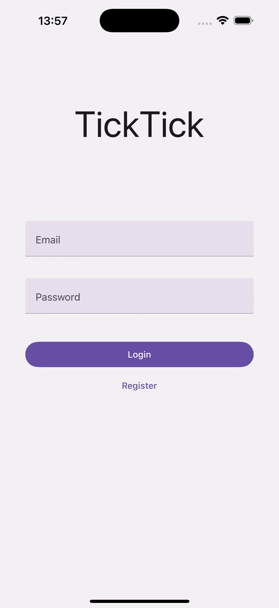
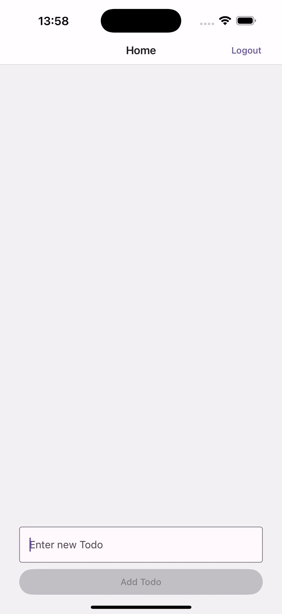

# Test Task (_Tiko Energy_) – Artem Astrouski

This repository contains my implementation of a test task for Tiko Energy company, completed on July 30, 2024. It showcases a fully
functional Todo List application. The task involved implementing user authentication (registration, login, and logout)
with token-based access, as well as full CRUD operations for a Todo list.

---

## 📝 Project Requirements

1. **Authentication Flow**:
    - Users can register with input validation and log in to their account.
    - Tokens persist across sessions, and the app supports automatic token refreshing.
    - A logout process that clears the entire app state.

2. **Todo List Management**:
    - Perform CRUD operations (Create, Read, Update, Delete) on Todos.
    - Todos are fetched from the backend whenever the user navigates to the screen displaying the full list.

3. **Technical Stack**:
    - There were no specific technical stack requirements; the choice of tools and libraries was left entirely to the developer.

---

## ⚙️ Implementation Details

### **1. Data Access Layer (DAL):**

To handle API requests, I used Axios, leveraging its powerful interceptor API to centralize error handling and implement
automatic token refreshing:

- **Centralized Error Handling**: All API errors are intercepted in one place, making debugging easier and ensuring
  consistent error logging across the application.
- **Automatic Token Refresh**: When a 401 Unauthorized response is detected, a refresh token is used to obtain a new
  access token, and the original request is retried seamlessly.

### **2. State Management:**

Considering the project size, I opted for **useReducer** and **useContext** to manage state. This approach is
lightweight and efficient for smaller apps, avoiding the need for heavier libraries like Redux. While I have extensive
experience with Redux, simpler tools were more appropriate for this task.

### **3. Persistent Storage:**

Tokens are securely stored in **MMKV**, a fast and efficient key-value storage designed for React Native. This enables
seamless token persistence across app sessions.

---

## 🎥 Demo

<table>
  <tr>
    <td></td>
    <td></td>
    <td></td>
  </tr>
</table>

---

## 🛠️ Stack

- **Core**: React Native, TypeScript
- **Navigation**: React Navigation
- **State Management**: `useReducer` + `useContext`
- **Persistent Storage**: MMKV
- **API Communication**: Axios

---

## 📦 Installation

```bash
# Clone the repository
git clone https://github.com/a-astrouski/test-task-tiko-energy.git
cd test-task-tiko-energy

# Install dependencies
yarn install

# Install iOS pods
cd ios && pod install && cd ..

# Run the iOS Application
yarn ios

# Run the Android Application
yarn android


